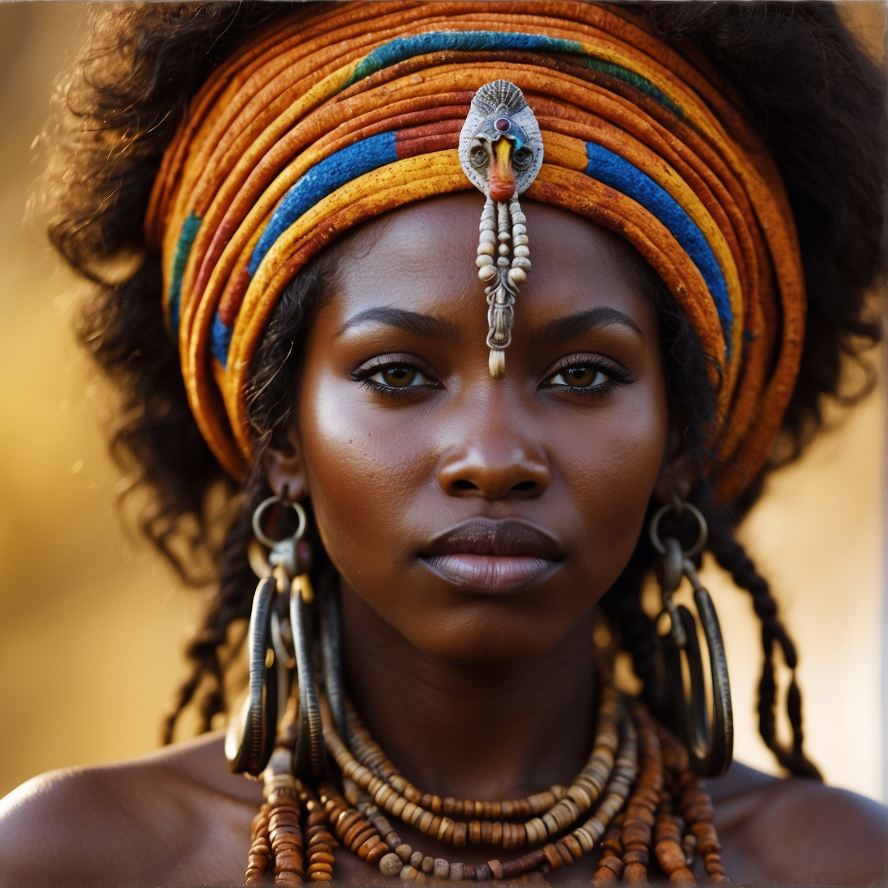
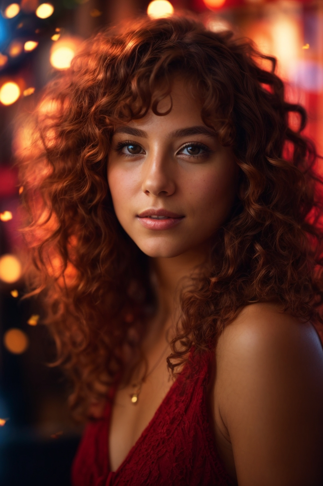
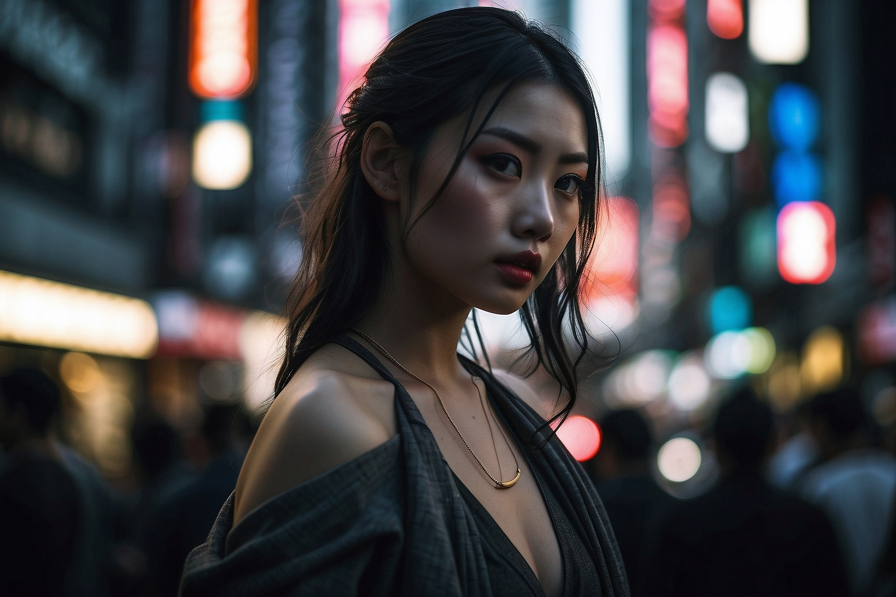
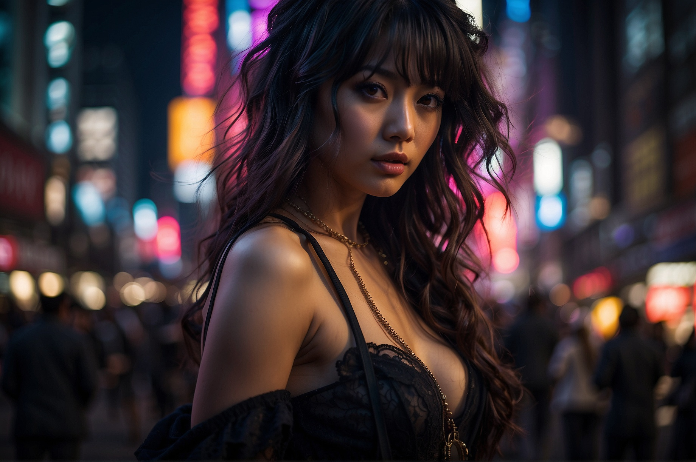
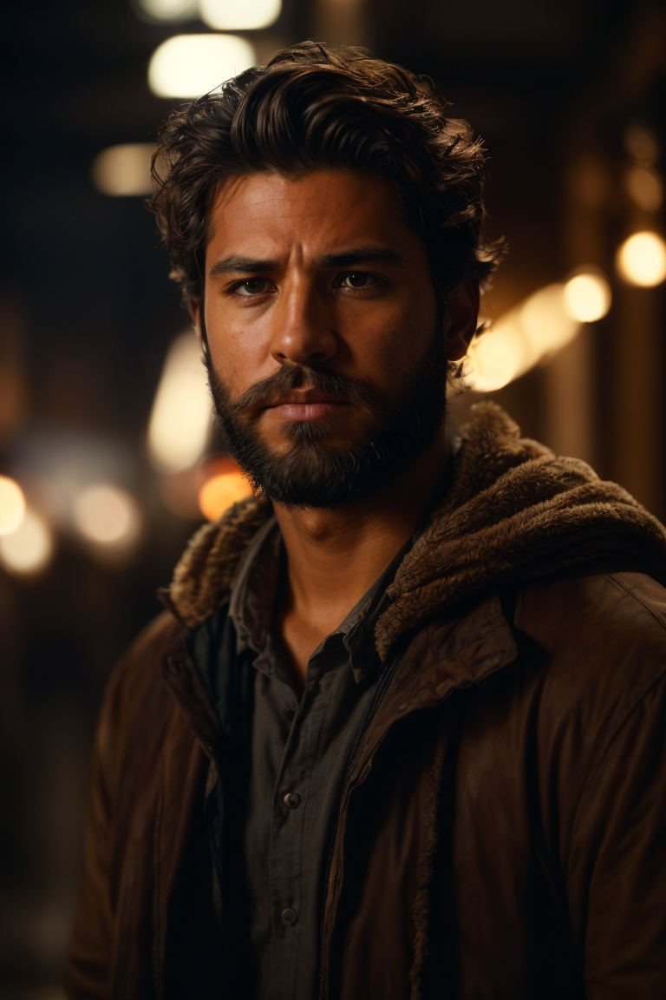
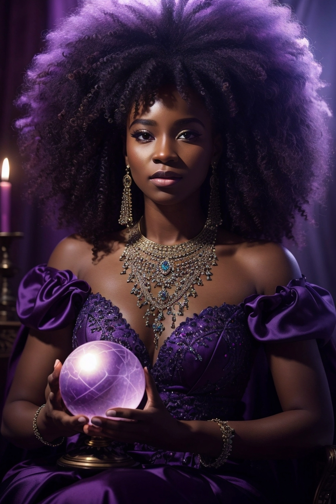

# Ecos de IA: Uma Jornada Artística entre Imagem, Poesia e Voz

## 📒 Descrição

Este projeto explora a sinergia entre arte, poesia e inteligência artificial generativa, resultando em uma experiência multissensorial única. Através do Leonardo.AI, ChatGPT e Eleven Labs, dei vida a imagens artísticas e fotorrealistas, uma poesia original e uma narração sintética rica em emoção. Além das imagens apresentadas no vídeo final, o projeto inclui uma galeria expandida com outras criações do Leonardo.AI, explorando as nuances e possibilidades da geração de imagens por IA.

## 🤖 Tecnologias Utilizadas

* **Leonardo.AI:** Geração de imagens (artísticas, fotorrealistas e galeria expandida)
* **ChatGPT:** Criação da poesia
* **Eleven Labs:** Síntese de voz e narração
* **Adobe Premiere:** Edição e legendagem do vídeo final

## 🧐 Processo de Criação

1. **Imagens:** No Leonardo.AI, utilizei prompts detalhados, explorando diferentes estilos e técnicas de refinamento para obter imagens que refletissem minha visão artística. A galeria expandida demonstra a versatilidade da ferramenta e a importância da engenharia de prompt na geração de resultados diversos e criativos.

2. **Poesia:** Com o ChatGPT, usei engenharia de prompt para guiar o modelo na criação de uma poesia com estilo, tom e naturalidade específicos.

3. **Narração:** Na Eleven Labs, selecionei uma voz que combinasse com a poesia, ajustando tom, cadência e emoção para uma narração envolvente.

4. **Edição:** No Adobe Premiere, combinei as imagens, a poesia narrada e legendas para criar um vídeo coeso e esteticamente agradável.

## 🚀 Resultados

### "The Void" - Vídeo Completo

O vídeo combina arte visual, poesia e narração sintética em uma experiência única e envolvente. As imagens geradas pelo Leonardo.AI são esteticamente impressionantes, a poesia criada pelo ChatGPT é tocante e a narração da Eleven Labs adiciona uma camada extra de emoção.

 

**👉 [The Void - AI Poetry](https://youtube.com/shorts/AicWssqBCao) 👈** 

 

### Galeria de Imagens (Leonardo.AI)

A galeria expandida oferece um vislumbre adicional do potencial criativo da IA na geração de imagens. Explore as diversas criações, cada uma com seu próprio estilo e temática.

 

  
  
  
  
  
  

## 💭 Reflexão

O desafio de criar algo "natty" com IA reside em equilibrar a criatividade humana com o poder da tecnologia. A engenharia de prompt é fundamental para guiar as IAs na direção desejada, mas é a nossa visão artística e sensibilidade que dão vida ao projeto. Este Lab me proporcionou um mergulho fascinante no mundo da IA generativa, mostrando seu potencial para transformar a maneira como criamos e consumimos arte.

## 🔗 Links:

* **Leonardo.AI:** [https://leonardo.ai/](https://leonardo.ai/)
* **Eleven Labs:** [https://elevenlabs.io/](https://elevenlabs.io/)
